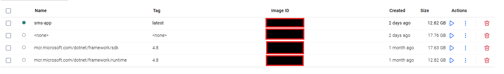

# Dockerizing a .NET Framework Application with SQL Server

This document outlines the key challenges encountered while containerizing the **SMS (.NET Framework 4.8)** application that depends on a **Microsoft SQL Server** backend.  
The objective was to create a reproducible and platform-independent setup using Docker and Docker Compose — without requiring manual installation of .NET or SQL Server.

| Area             | Challenge                                                   |
| ---------------- | ----------------------------------------------------------- |
| Platform Support | .NET Framework 4.8 is Windows-only                          |
| SQL Server       | No official Windows container image                         |
| Dependency       | Custom Picture Box.dll cannot be built by MSBuild in Docker |
| Host Requirement | Windows 10/11 Pro/Enterprise or Server required             |
| Container Type   | Windows containers only                                     |
| Build System     | BuildKit unsupported; must use legacy build engine          |
| Image Size       | 12-17 GB base image; slow build and deployment              |
| Cross-Platform   | GNU/Linux users must use separate SQL container             |

---

## <b>1. Challenge: Windows Dependency of .NET Framework</b>

The SMS application is built on **.NET Framework 4.8**, which is **exclusive to Windows**.  
Unlike modern .NET versions (Core 7+), it cannot execute in GNU/Linux-based containers.

This dependency enforces the use of **Windows containers**, which:
- Require **Windows 10/11 Pro**, **Enterprise**, or **Server** editions.
- Depend on **Hyper-V virtualization** (unavailable on Windows Home).
- Are typically **large and slower** to build.
- Cannot interoperate with GNU/Linux containers within the same Docker engine session.

This creates compatibility challenges for GNU/Linux or Windows Home users.

---

## <b>2. Challenge: Build and Runtime Layer Management</b>

Building the .NET Framework application demands the **SDK image**, while runtime execution uses a smaller **runtime image**.  
Multi-stage builds work on Windows, but are inefficient due to the massive image sizes (12–17 GB).

---

## <b>3. Challenge: SQL Server Integration</b>

The application relies on **Microsoft SQL Server** for database operations.  
However, Microsoft no longer provides **Windows-based SQL Server container images** (support was discontinued after SQL Server 2017).

<b>Implications:</b>
- Windows-based .NET containers does not have an equivalent Windows SQL image.
- Only the **GNU/Linux-based SQL Server image** is officially supported.
- Developers must configure cross-platform networking between a Windows container (for .NET Framework) and a GNU/Linux container (for SQL Server).


---

## <b>4. Challenge: Connection String Configuration</b>

When the application runs in a container, `localhost` refers to that specific container, not the host or another service.  
This requires using container or service names in connection strings (for example: `Server=sqlserver,1433;`).

Maintaining consistent connection strings across:
- Local environments,
- Windows container deployments, and
- GNU/Linux SQL Server instances
adds configuration overhead.

---

## <b>5. Challenge: Custom Package Dependency (Custom Picture Box.dll)</b>

The project depends on a third-party component — **Custom Picture Box.dll**  — located in the project’s `Custom Picture Box/bin/Debug` directory.

<b>Problem:</b>
- `MSBuild` cannot properly resolve this reference inside the Docker build environment.
- Even when the DLL is copied manually, dependency resolution fails because the path structure and GAC references differ inside the container.
- The Dockerfile build step (`msbuild /p:Configuration=Release`) terminates with a missing reference error for `Custom Picture Box.dll`.

This prevents the Docker image from being built automatically unless the dependency is restructured or included via a NuGet-compatible source.

---

## <b>6. Challenge: Docker for Windows Host Requirements</b>

Running Windows containers requires specific system configurations:
- Docker Desktop must be switched to **Windows Containers**.
- **Hyper-V** must be enabled.
- **Windows Home Edition** users cannot run Windows containers.

Developers on unsupported versions of Windows (e.g., Home) or GNU/Linux based systems cannot natively build or run this project.

---

## <b>7. Challenge: Docker BuildKit Compatibility</b>

`BuildKit`, the modern backend for Docker builds, is **not compatible** with Windows base images.

- Setting `DOCKER_BUILDKIT=1` is ignored for Windows containers.
- The environment variable must be set to `0` before building:
  ```powershell
  setx DOCKER_BUILDKIT 0

Otherwise for each session

  ```powershell
 $env:DOCKER_BUILDKIT=0:


<b>8. Challenge: Image Size and Performance</b>



The Windows-based .NET Framework images:

mcr.microsoft.com/dotnet/framework/sdk:4.8

mcr.microsoft.com/dotnet/framework/runtime:4.8

are very large (~17 GB).
This impacts build time, consumes disk space.

For comparison, a GNU/Linux-based .NET 8 image is often under 300 MB.

---

<b>Building the Image on Windows</b>

<b>Note:</b> These steps assume Windows 10/11 Pro or Enterprise with Docker Desktop set to Windows Containers.

Switch Docker to Windows Containers:

Right-click the Docker icon → Switch to Windows Containers


To disable BuildKit on Windows PowerShell:

```powershell
setx DOCKER_BUILDKIT 0


For single session you can use the following command
```powershell
$env:DOCKER_BUILDKIT=0 docker build -t sms-app -f Dockerfile.windows .

Run the container:
```powershell
docker run --name sms-app sms-app

This will create an image and container; however, since it does **not** have an exposed port, the application output will **not** be visible as it uses _Windows Presentation Foundation (WPF) Form_.


